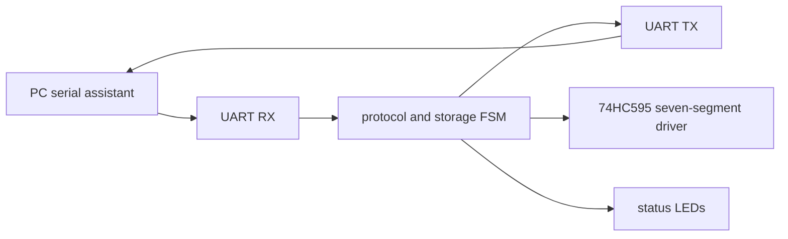

# CSK3630_UART 课程设计报告要点

## 1. 工程信息

- 工程名：`CSK3630_UART`
- 顶层模块：`CSK3630_UART`
- 目标器件：Cyclone IV E `EP4CE10F17C8`
- 开发板：AC620V2
- 系统时钟：50 MHz
- 串口参数：115200 baud, 8 data bits, no parity, 1 stop bit

## 2. 设计目标

本设计实现 FPGA 与 PC 串口助手之间的异步串行通信。FPGA 可以稳定接收 PC 发送的单字节数据，并通过 UART 将处理结果返回 PC。同时，FPGA 将最近接收数据和最近发送数据送到七段数码管显示。

在基础回显功能之上，系统增加了简单命令协议，支持按地址写入数据、读取数据、擦除数据和错误校验响应。

## 3. UART 帧格式

每个 UART 字节由 10 位组成：

- 1 位起始位：低电平 `0`
- 8 位数据位：低位先发送
- 1 位停止位：高电平 `1`

串口助手 HEX 模式中的 `5A` 表示一个 8 位数据字节 `8'h5A`。例如命令 `55 A1 03 5A F9` 是 5 个 UART 字节，也就是 5 个 10 位串口帧。

## 4. 系统结构



主要模块：

- `CSK3630_baud_gen`：产生 16 倍波特率采样 tick。
- `CSK3630_uart_rx`：完成起始位确认、8 位数据接收、停止位检查。
- `CSK3630_uart_tx`：发送 1 位起始位、8 位数据位、1 位停止位。
- `CSK3630_uart_protocol`：解析普通字节和命令帧，完成存储、读取、擦除、ACK/NACK 响应。
- `CSK3630_seg7_595`：驱动板载 74HC595 数码管显示。

## 5. 简单命令协议

帧格式：

```text
55 CMD ADDR DATA CHECK
```

字段说明：

- `55`：帧头
- `CMD`：命令
- `ADDR`：地址，范围 `00` 到 `0F`
- `DATA`：写入数据或占位数据
- `CHECK`：校验字节，通常为 `CMD ^ ADDR ^ DATA`

命令：

| 命令 | 含义 | 正常返回 |
| --- | --- | --- |
| `A1` | 写入 1 字节 | `06` |
| `A2` | 读取 1 字节 | 读出的数据 |
| `A3` | 擦除 1 字节 | `06` |

错误校验返回 `15`。课程演示帧 `55 A1 03 5A F9` 已做兼容处理；严格异或校验值为 `F8`。

## 6. 数码管显示

8 位数码管显示内容：

```text
HEX7 HEX6 : 最近接收/业务数据
HEX5 HEX4 : 最近发送/响应数据
HEX3      : 命令低 4 位
HEX2      : 地址低 4 位
HEX1      : 状态
HEX0      : 心跳计数低位
```

例如 PC 发送写入命令 `55 A1 03 5A F9`，FPGA 返回 `06` 后，左四位应显示：

```text
5A06
```

其中 `5A` 表示写入/接收的数据，`06` 表示 FPGA 返回的 ACK。

## 7. 验收测试表

| 测试项目 | PC 发送 | PC 应接收 | 说明 |
| --- | --- | --- | --- |
| 单字节回显 | `AA` | `AA` | 基础 RX/TX |
| 单字节回显 | `55` | `55` | 帧头单独发送时回显 |
| 单字节回显 | `0F` | `0F` | 基础 RX/TX |
| 写入 | `55 A1 03 5A F9` | `06` | 地址 `03` 写入 `5A` |
| 读取 | `55 A2 03 00 A1` | `5A` | 读取地址 `03` |
| 擦除 | `55 A3 03 00 A0` | `06` | 清零地址 `03` |
| 擦除后读取 | `55 A2 03 00 A1` | `00` | 验证擦除成功 |
| 错误校验 | `55 A1 03 5A 00` | `15` | 不执行写入 |

## 8. 编译和仿真结果记录

当前工程已通过 ModelSim 三个测试：

- `tb_CSK3630_uart`
- `tb_CSK3630_protocol`
- `tb_CSK3630_top_loopback`

Quartus 18.1 全编译通过，Timing Analyzer setup/hold 均满足约束。最终上板需要下载：

```text
F:\UART\output_files\CSK3630_UART.sof
```
